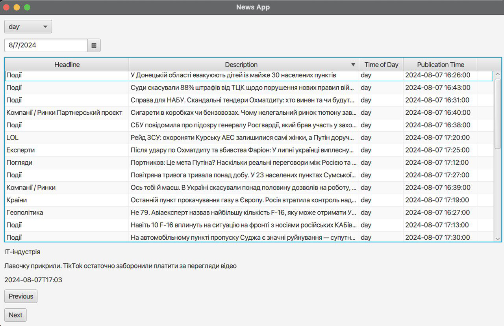

# News Parser App

This project is a news parsing application that uses JavaFX for displaying news and Spring Boot for backend operations. News is parsed from a website, stored in a MySQL database, and displayed through a graphical interface.


## Requirements

- JDK 17 or later
- MySQL
- Maven
- JavaFX SDK (for JavaFX applications)

## Database Setup

1. Start the MySQL server.
2. Execute the following SQL commands to create the database and table:

```sql
CREATE DATABASE newsdb;

USE newsdb;

CREATE TABLE news (
    id INT AUTO_INCREMENT PRIMARY KEY,
    headline VARCHAR(255) NOT NULL,
    description TEXT,
    publication_time TIMESTAMP DEFAULT CURRENT_TIMESTAMP,
    time_of_day VARCHAR(10) DEFAULT 'unknown'
);
